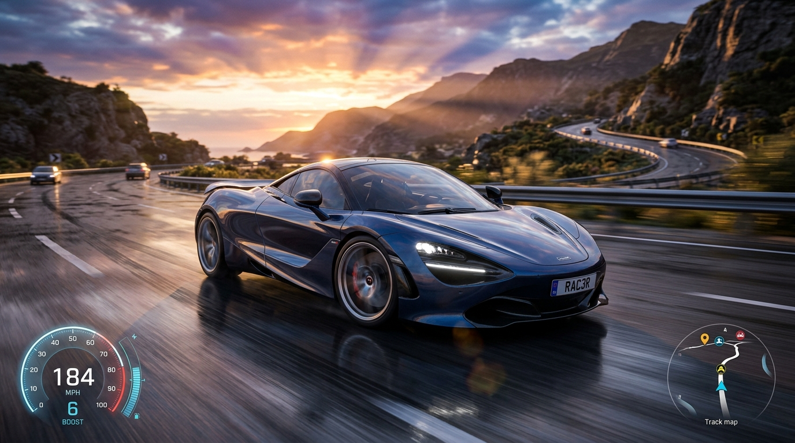

# OVERDRIVE 4K 🏎️💨

> **Ultra-Realistic Highway Racer built with WebGL & Three.js**



## 🌟 Overview

**OVERDRIVE 4K** is a high-speed arcade highway racing simulator with rich visuals, dynamic lighting, customizable supercars, dynamic traffic AI, and interactive HUD.

## 🚀 Features

- **High-End 3D Graphics**: Built on Three.js with metallic paint shaders, wet road surface reflections, realistic lighting, and motion blur effects.
- **Dynamic AI Traffic**: Avoid oncoming and same-direction AI traffic (sports cars, sedans, semi-trucks).
- **Near Miss Scoring**: Weave closely past traffic cars at high speed to build combo multipliers.
- **Synthesized Audio Engine**: Zero audio file dependencies — fully synthesized Web Audio engine (engine RPM, turbo blow-off, nitro roar, and tire screech).
- **Multiple Camera Angles**: Dynamic Chase Cam, Cockpit/Hood Cam, Low Bumper Cam, and Cinematic Drone Cam.
- **Dynamic Weather & Time of Day**: Sunset Dusk, Cyber Night, Wet Storm, and Sunrise.
- **Photo Studio Mode**: Pause gameplay, apply cinematic HDR filters, and capture 4K snapshots.

## 🕹️ Controls

| Key | Action |
| --- | --- |
| `W` / `↑` | Accelerate |
| `S` / `↓` | Brake / Reverse |
| `A` / `D` or `←` / `→` | Steer Left / Right |
| `SHIFT` | Nitro Boost |
| `SPACE` | Drift / Handbrake |
| `C` | Change Camera View |
| `T` | Change Time & Atmosphere |
| `M` | Mute / Unmute Audio |
| `P` / `ESC` | Photo Studio Mode |

## 🛠️ Quick Start

You can run this project locally without any complex installation:

```bash
# Using Python
python -m http.server 8000

# Open http://localhost:8000 in your browser
```

## 📜 License

MIT License. Created by [ruhanawan623-rgb](https://github.com/ruhanawan623-rgb).
